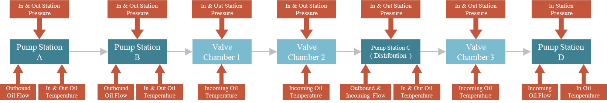

# Papers and Topics
This repository is the official implementation code of the IPC 2022 conference - "Benchmark Algorithm for Pipeline Data Expansion Based on Deep Generative Models".

## Abstract
As shown in the figure below, the data generated by the simulation includes a total of four stations (four pumping stations, one of which is a sub-transport station) and three valve chambers.




## Code dependencies (Requirements):
use python with anaconda
````setup
conda install numpy, pandas, scipy, matplotlib, seaborn, pytorch
````

## Instructions for use
Step 1. Modify the './DATA/DATA2Git.xlsx' form, and fill in the corresponding battlefield flow and temperature.   
Step 2. Run the program, it will generate './DATA/OutputResults.xlsx'.


## result
See paper, to be added


# To Do List:
1. update more function.
